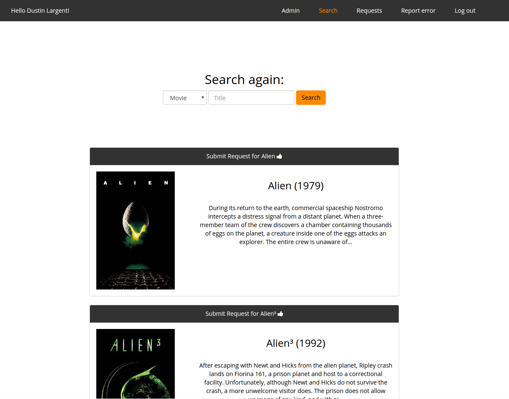

#plex-request

A web app for people to submit requests for content to be added to a Plex server. Uses [The Movie DB](https://www.themoviedb.org/)'s API, many thanks to them. This project is not affiliated in any way with [Plex Inc.](https://www.plex.tv/). Many thanks to them too, for creating the ultimate media streaming software.

###Installation steps:

- Clone the repo.
- Run 'composer install' to resolve your dependencies.
- ```cp .env.example .env.```
- ```php artisan key:generate```
- In .env, fill in the values for your environment. PASS_PHRASE is what users need to enter during registration to make an account. 
- If you're using Vagrant, cd into the project dir on your local machine, run 'vagrant up', and let the box provision. 
- Change directory to your apache root on your server and run 'php artisan migrate' to create the necessary tables.
- Access the app in your browser at http://192.168.33.10/ or update your hosts file and map your desired hostname to the IP previously mentioned. 

###To do:

- Continue working on fulfillment system w/ messages from admins.
- Add support for cancelled requests in admin panel


###Request status codes:
0 - pending

1 - filled 

2 - declined

3 - cancelled (by user)